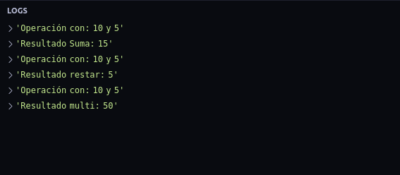
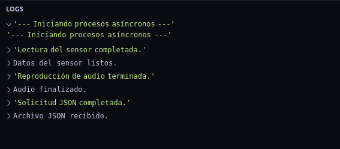
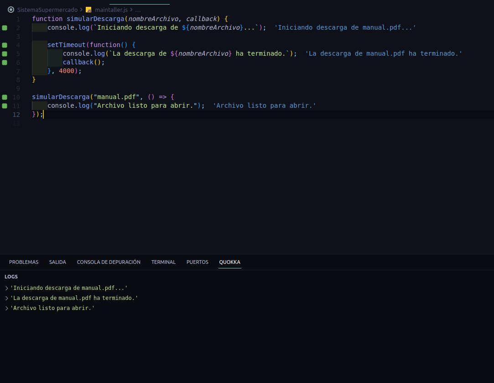

TALLER PRÁCTICO: ASINCRONÍA Y CALLBACKS EN JAVASCRIPT

Autor: [Dilan Andres Fonseca Tellez]

Los cogidos estan en el maintaller.js

====================================================
OBJETIVO
========

Implementar y analizar soluciones utilizando callbacks y tareas asíncronas en JavaScript para comprender cómo funciona el comportamiento no bloqueante del lenguaje.

====================================================
PARTE 1. CALLBACKS BÁSICOS
==========================

Código Fuente

```javascript
function realizarOperacion(num1, num2, operacionCallback) {
    console.log(`Operación con: ${num1} y ${num2}`);
    operacionCallback(num1, num2);
}

function sumar(a, b) {
    console.log(`Resultado Suma: ${a + b}`);
}

function restar(a, b) {
    console.log(`Resultado Resta: ${a - b}`);
}

function multiplicar(a, b) {
    console.log(`Resultado Multiplicación: ${a * b}`);
}

realizarOperacion(10, 5, sumar);
realizarOperacion(10, 5, restar);
realizarOperacion(10, 5, multiplicar);
```

Salida Esperada

```text
Operación con: 10 y 5
Resultado Suma: 15

Operación con: 10 y 5
Resultado Resta: 5

Operación con: 10 y 5
Resultado Multiplicación: 50
```

Preguntas de Reflexión

1. ¿Qué ventaja tiene enviar una función como parámetro?

Permite reutilizar la misma función principal para realizar diferentes tareas sin modificar su código. Hace el programa más flexible y modular.

2. ¿Qué ocurre si enviamos una función diferente como callback?

Se ejecutará la nueva función enviada, por lo que el comportamiento de realizarOperacion cambiará según el callback recibido.

3. ¿La función principal necesita conocer qué operación matemática se ejecutará?

No. La función principal solo recibe y ejecuta el callback. La operación específica la decide la función que se envía como parámetro.

====================================================
PARTE 2. COMPRENDIENDO LA ASINCRONÍA
====================================

Código Fuente

```javascript
function tareaNoBloqueante(callback) {
    console.log("Iniciando tarea no bloqueante...");

    setTimeout(function() {
        console.log("Tarea completada.");
        callback();
    }, 2000);
}

console.log("Inicio del programa.");

tareaNoBloqueante(function() {
    console.log("Continuando después de la tarea.");
});

console.log("Fin del programa.");
```

Predicción del Orden de Salida

1. Inicio del programa.
2. Iniciando tarea no bloqueante...
3. Fin del programa.
4. Tarea completada.
5. Continuando después de la tarea.

Resultado Real

```text
Inicio del programa.
Iniciando tarea no bloqueante...
Fin del programa.
Tarea completada.
Continuando después de la tarea.
```

Análisis

1. ¿Coincidió tu predicción con el resultado?

Sí. El programa ejecuta primero todas las instrucciones síncronas y después ejecuta el código que está dentro de setTimeout().

2. ¿Por qué el mensaje "Fin del programa" aparece antes que "Tarea completada"?

Porque setTimeout() es una operación asíncrona. JavaScript programa la ejecución de la función para dentro de 2 segundos y continúa ejecutando el resto del código sin esperar.

3. ¿Qué papel cumple setTimeout() en este comportamiento?

setTimeout() retrasa la ejecución de una función durante un tiempo determinado, permitiendo que el programa continúe ejecutándose sin bloquearse.

====================================================
PARTE 3. SIMULACIÓN DE PROCESOS REALES
======================================

Código Fuente

```javascript
function solicitarJSON(callback) {
    setTimeout(() => {
        console.log("Solicitud JSON completada.");
        callback();
    }, 3000);
}

function reproducirAudio(callback) {
    setTimeout(() => {
        console.log("Reproducción de audio terminada.");
        callback();
    }, 1000);
}

function leerSensor(callback) {
    setTimeout(() => {
        console.log("Lectura del sensor completada.");
        callback();
    }, 500);
}

console.log("--- Iniciando procesos asíncronos ---");

solicitarJSON(() => console.log("Archivo JSON recibido."));
reproducirAudio(() => console.log("Audio finalizado."));
leerSensor(() => console.log("Datos del sensor listos."));
```

Resultado Real

```text
--- Iniciando procesos asíncronos ---
Lectura del sensor completada.
Datos del sensor listos.
Reproducción de audio terminada.
Audio finalizado.
Solicitud JSON completada.
Archivo JSON recibido.
```

Orden de Finalización

1. leerSensor (500 ms)
2. reproducirAudio (1000 ms)
3. solicitarJSON (3000 ms)

Preguntas

1. ¿Cuál terminó primero?

leerSensor, porque tiene el menor tiempo de espera.

2. ¿Cuál terminó último?

solicitarJSON, porque tiene el mayor tiempo de espera.

3. ¿Por qué el orden de finalización es diferente al orden de ejecución?

Porque todas las funciones comienzan prácticamente al mismo tiempo y terminan según el tiempo configurado en setTimeout().

====================================================
PARTE 4. DISEÑANDO TU PROPIA OPERACIÓN ASÍNCRONA
================================================

Código Fuente

```javascript
function simularDescarga(nombreArchivo, callback) {
    console.log(`Iniciando descarga de ${nombreArchivo}...`);

    setTimeout(() => {
        console.log(`La descarga de ${nombreArchivo} ha terminado.`);
        callback();
    }, 4000);
}

simularDescarga("manual.pdf", () => {
    console.log("Archivo listo para abrir.");
});
```

Salida Esperada

```text
Iniciando descarga de manual.pdf...
(espera 4 segundos)
La descarga de manual.pdf ha terminado.
Archivo listo para abrir.
```

Explicación

1. Se llama a simularDescarga().
2. Se muestra el mensaje de inicio de descarga.
3. setTimeout() programa una tarea para ejecutarse después de 4 segundos.
4. JavaScript continúa funcionando sin bloquear el programa.
5. Finalizado el tiempo de espera, se muestra el mensaje de descarga completada.
6. Se ejecuta el callback.
7. Se muestra el mensaje "Archivo listo para abrir".

====================================================
PARTE 5. ANÁLISIS DEL CALLBACK HELL
===================================

Código Analizado

```javascript
obtenerUsuario(() => {
    obtenerPedidos(() => {
        obtenerFactura(() => {
            enviarCorreo(() => {
                console.log("Proceso finalizado");
            });
        });
    });
});
```

1. Describe el problema visual que presenta el código.

El código presenta una estructura muy anidada hacia la derecha, formando una especie de escalera o pirámide. A medida que se agregan más operaciones asíncronas, la indentación aumenta y el código se vuelve difícil de leer.

2. Explica qué es el Callback Hell.

El Callback Hell es una situación que ocurre cuando múltiples operaciones asíncronas dependen unas de otras y se implementan mediante callbacks anidados. Esto genera código complejo, difícil de leer y complicado de depurar.

3. ¿Por qué dificulta el mantenimiento de aplicaciones grandes?

* Reduce la legibilidad del código.
* Hace más difícil encontrar errores.
* Complica la reutilización de funciones.
* Incrementa la posibilidad de errores al modificar el programa.
* Hace más difícil agregar nuevas funcionalidades.
* Dificulta el manejo de errores.

4. Menciona dos alternativas modernas para evitar este problema.

A) Promesas (Promises)

```javascript
obtenerUsuario()
    .then(() => obtenerPedidos())
    .then(() => obtenerFactura())
    .then(() => enviarCorreo())
    .then(() => console.log("Proceso finalizado"))
    .catch(error => console.error(error));
```

B) Async / Await

```javascript
async function proceso() {
    try {
        await obtenerUsuario();
        await obtenerPedidos();
        await obtenerFactura();
        await enviarCorreo();

        console.log("Proceso finalizado");
    } catch(error) {
        console.error(error);
    }
}
```

Conclusión

Las Promesas y Async/Await permiten escribir código asíncrono más limpio, legible y fácil de mantener, evitando el problema conocido como Callback Hell.

====================================================
EVIDENCIAS
==========

Agregar en esta sección las capturas de pantalla de la consola:

* Captura Parte 1: Callbacks Básicos.

* Captura Parte 2: Comprendiendo la Asincronía.
* Captura Parte 3: Simulación de Procesos Reales.

* Captura Parte 4: Operación Asíncrona Propia.


====================================================
FIN DEL DOCUMENTO
=================
